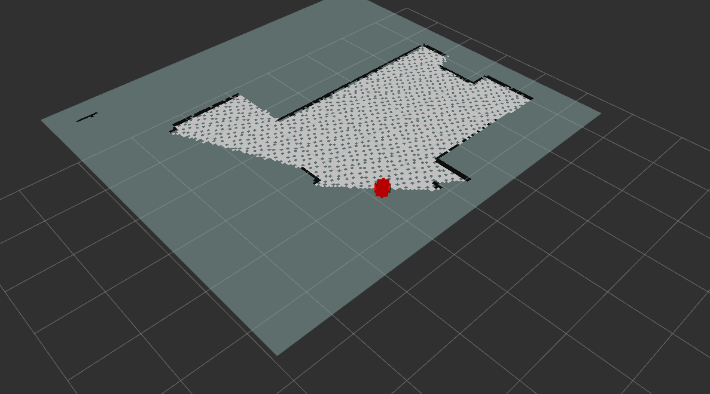
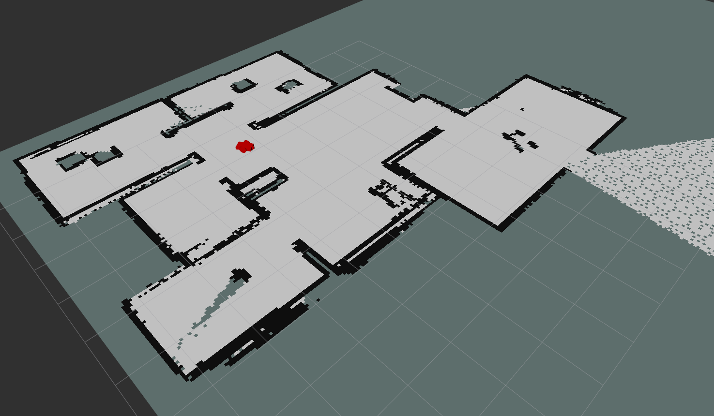
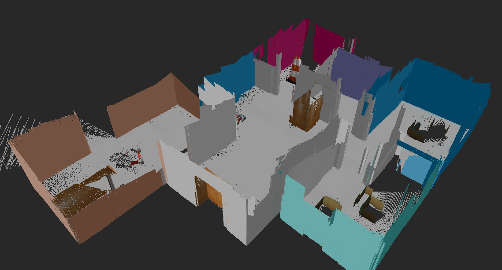

# Map my World

> This is a project where a robot maps its environment using rtabmap

This project uses the robot and environment models found [here](https://github.com/lemontyc/my_robot). It uses ros [rtabmap_ros](http://wiki.ros.org/rtabmap_ros).


## Requirements

* Tested on ROS at Ubuntu 20.04 and 16.04.
* Required ROS packages:
```sh
$ sudo apt-get install ros-noetic-rtabmap-ros
$ sudo apt-get install ros-noetic-teleop_twist_keyboard
```

## Running
1. Clone this package to your ``<ROS_workspace/src>``
2. Compile:
```sh
$ catkin_make
```
3. Launch world:
```sh
$ roslaunch my_robot world.launch
```
3. Launch localization:
```sh
$ roslaunch my_robot mapping.launch
```
4. Start rviz and add a ``RobotModel`` and ``map`` subscribed to topic ``/map``.
```sh
$ rviz
```
The robot should start creating a map of the environment:



5. Control the robot with your keyboard
```sh
$ rosrun rosrun teleop_twist_keyboard teleop_twist_keyboard.py
```
Traverse de environment with a low speed. Try to stick to the same path and do 3 loops.


4. Close everyhting and visualize the created map. (map is saved at ``/home/.ros/rtabmap.db)

```sh
$ rtabmap-databaseViewer ~/.ros/rtabmap.db
```
Click Ok if prompted to use database parameters.

Add the follwing visualizations:
* view -> Graph View (At the bottom you can see the global links. If you map has 5 or more, its a good map)

5. To view the 3D point cloud:
* Edit->View 3D Map.
* Leave everything as default and click OK.
* After processing:



## Meta

* **Luis M.**           - [GitHub](https://github.com/lemontyc)


Distributed under the MIT License. See ``LICENSE`` for more information.

This project was developed for the **Robotics Software Engineer** nanodegree at **Udacity**.

